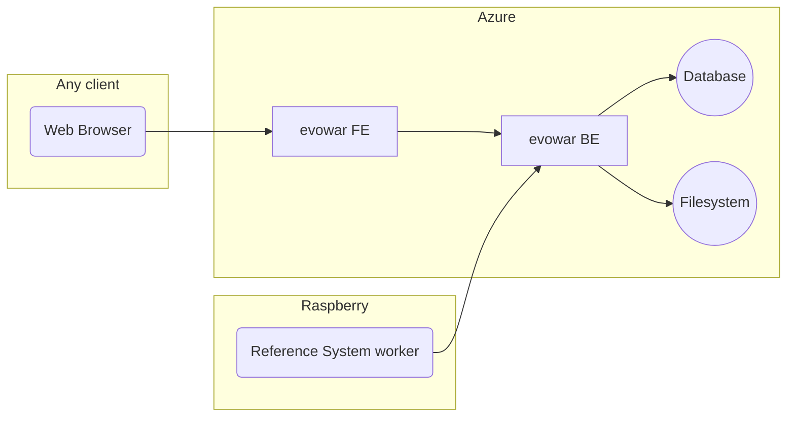
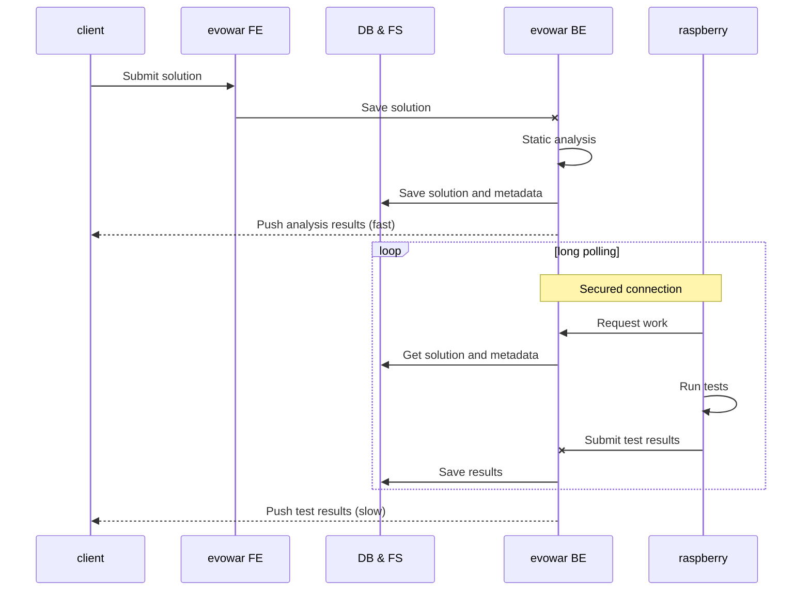
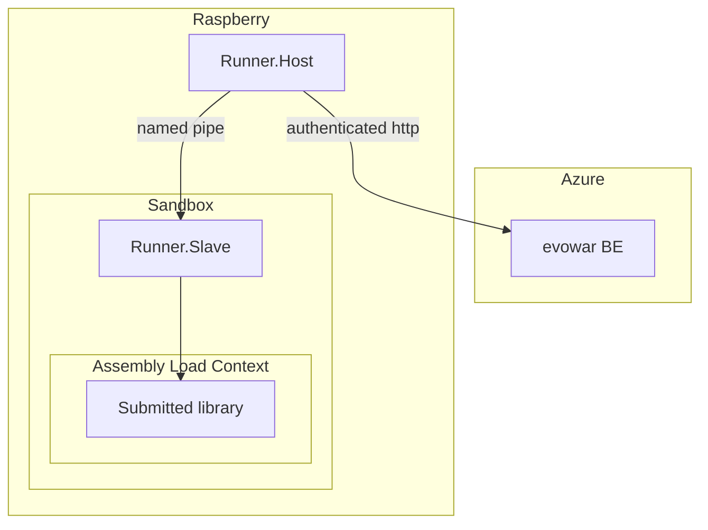
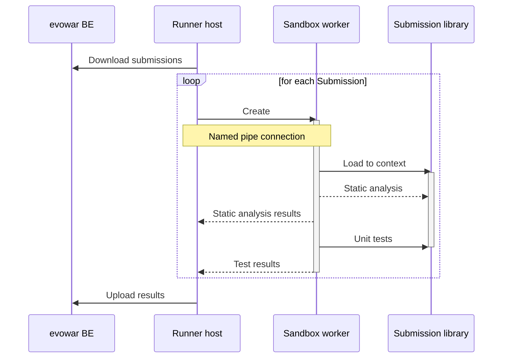

# evowar 2019 architecture

## Introduction
This document contains information about the general architecture of the components required to run the contest.

# Overview


# Web

## Submitting a solution

After submitting a solution, a static analysis is performed on the server, and tests are run on the reference system. 



# Raspberry


## Run submission checks



## Run performance measurements

```mermaid
sequenceDiagram

participant host as Runner host
participant fs as Filesystem
participant slave as Sandbox worker
participant sub as Submission library

loop while avg runtime &lt; 100ms
	opt no input available
		slave -->> host: Status message
		slave ->> slave: Generate harder input
		slave ->> fs: Save input
		Note over fs: Encrypted files
	end
	slave ->> fs: Load input
	loop n performance runs
		slave ->> sub: Load to context
		activate sub
		slave ->> sub: Warmup
		Note right of sub: easy input
		slave ->> sub: Measure
		Note right of sub: hard input
		deactivate sub
		slave ->> slave: validate results
		slave -->> host: Partial results
	end
end
slave -->> host: Total results
```
