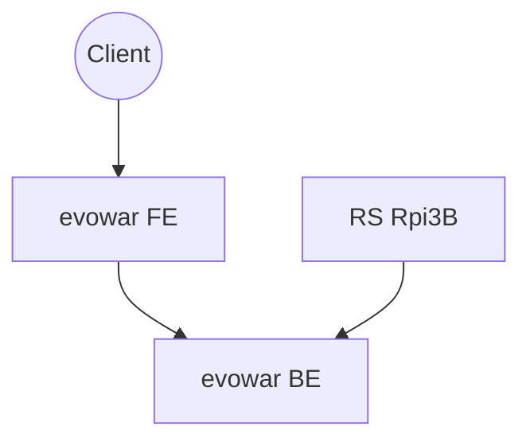
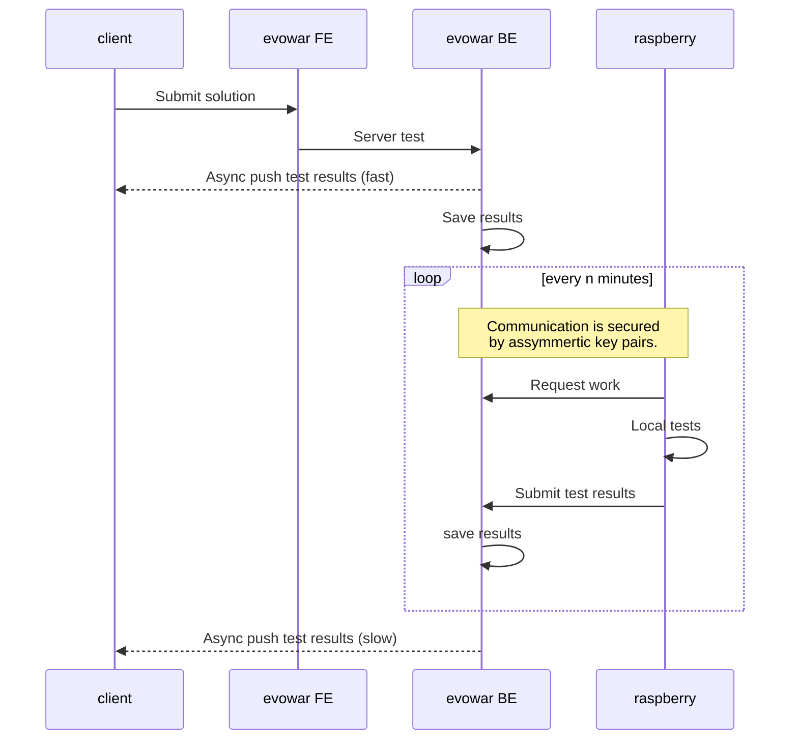

# evowar 2019 architecture

## Relations

```mermaid
graph TD
A((Client)) --> B[evowar FE]
B-->D[evowar BE]
C[RS Rpi3B]-->D
```

## Submitting a solution

```mermaid
sequenceDiagram

client ->> evowar FE:Submit solution
evowar FE ->> evowar BE: Server test
evowar BE -->> client: Async push test results (fast)
evowar BE ->> evowar BE: Save results

loop every n minutes
	Note over evowar BE, raspberry: Communication is secured<br/>by assymmertic key pairs.
	raspberry ->> evowar BE: Request work
	raspberry ->> raspberry: Local tests
	raspberry ->> evowar BE: Submit test results
	evowar BE ->> evowar BE: save results
end

evowar BE -->> client: Async push test results (slow)
```
