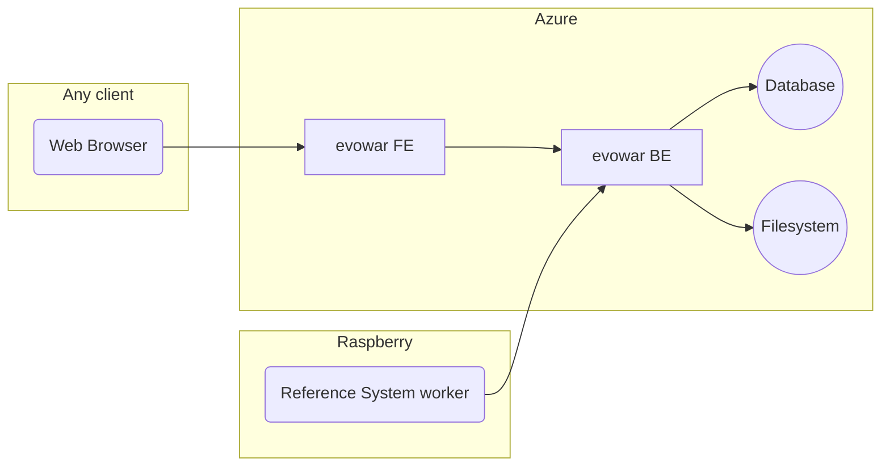
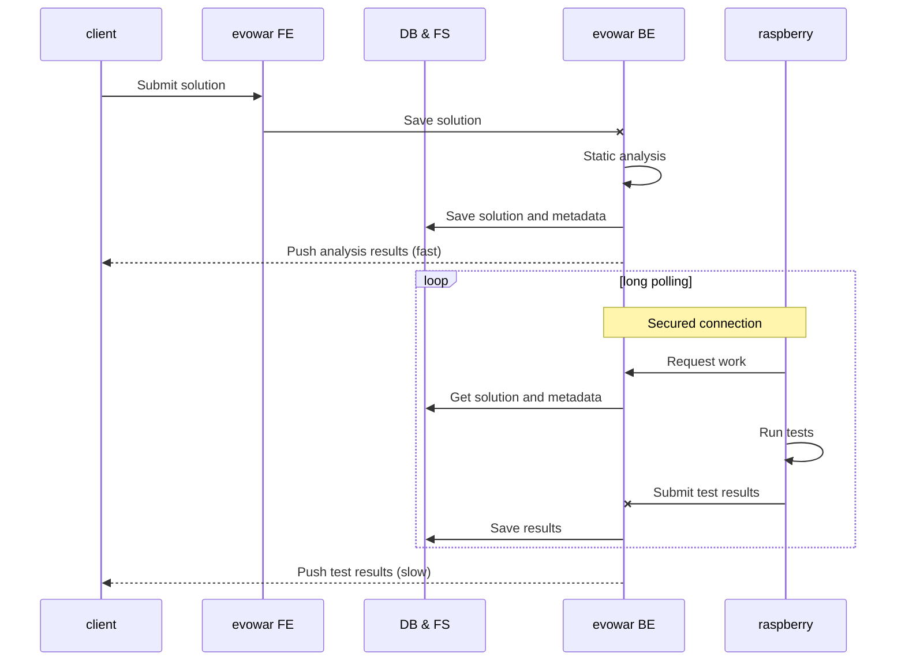

# evowar 2019 architecture

## Introduction
This document contains information about the general architecture of the components required to run the contest.

## Overview

## Submitting a solution

After submitting a solution, a static analysis is performed on the server, and tests are run on the reference system. 

