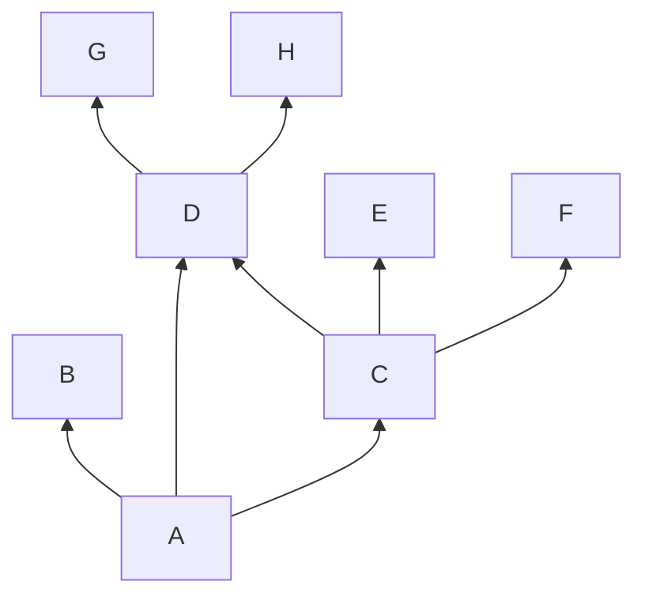
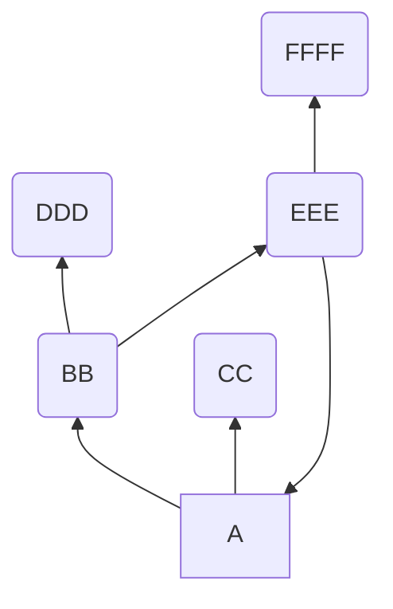

DDD FFFF DDD FFFF DDD FFFF DDD FFFF DDD FFFF DDD FFFF DDD FFFF DDD FFFF DDD FFFF A CC CC CC CC CC CC CC CC CC

((DDD (FFFF A)) CC)
((DDD EEE) CC)
(BB CC)
(A)

A(BB CC)
BB(DDD EEE)
EEE(FFFF A)

A(BB CC). BB(DDD EEE). DDD FFFF DDD FFFF DDD FFFF DDD FFFF DDD FFFF DDD FFFF DDD FFFF DDD FFFF DDD FFFF A CC CC CC CC CC CC CC CC CC. EEE(FFFF A).
