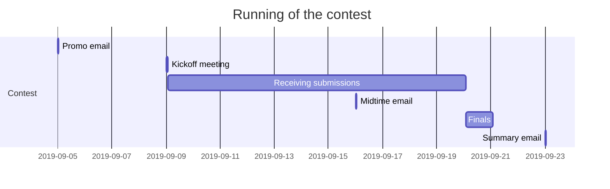

# evorace 2019 timeline

## Introduction
This document contains information about the forecasted timeline of the contest.

## Dev Timeline
```mermaid
gantt
title Development of the contest
dateFormat YYYY-MM-DD

section Misc
    now: now, 0d
    Summer vacation: vacation, 2019-08-27, 6d

section Challenge
    Find a good challenge: active, crit, challengeFind, 2019-06-25, 2d
    Solve varying time problem: challengeTime, after challengeFind, 2d
    Decide between avg/min time: 1d
    Alpha test: after challengeTime, 3d

section Web Logic
    Setup repo: done, 2019-06-18, 2d
    Create skeleton: done, webSkeleton, 2019-06-26, 1d

    Setup DB engine: done, webPickDb, 2019-06-27, 1d
    Setup azure server: webAzureSetup, after now, 1d
    Setup login: done, webLogin, 2019-06-27, 3d
    Testability (login, test data): after webLogin, 1d
    Setup sendgrid and login confirmation: webSendgrid, after webLogin, 1d

    Create EF + FS model: webModel, after webSkeleton, 1d
    
    Create work distributor: webDistributor, after webModel, 2d
    Daily runner job: 2d

    Activate site: crit, webActivate, 2019-09-08, 2h
    Make public repo: after webActivate, 2h

section Web Content
    Admin page: after webModel, 2d
    Submitter page: active, webSubmitter, after webDistributor, 3d
    Daily standings page: after webSubmitter, 2d
    Personal stats page: 2d
    Translate pages: after webSendGrid, 1d
    Privacy page: done, 2019-06-30, 1d

    Wiki challenge: after challengeFind, 1d
    Wiki environment: after subRepo, 1d
    Wiki solution: 1d
    Wiki submission: webWiki, after subPackager, 1d
    Wiki FAQ: 1d

    Final standings page: 1d

section Submission
    Setup repo: subRepo, after now, 1d
    Add sample: subSample, after subRepo, 1d
    Add runner: after subRepo, 2d
    
    Add tests: after subSample, 1d
    Add packager: subPackager, after subSample, 1d
    Add submitter: after subPackager, 1d
    
    Decide requirements: 1d

    Make repo public: crit, after webActivate, 2h

section Raspberry FW
    Create sandbox: done, rpiSandbox, 2019-07-01, 1d
    Safely communicate w/ sandbox: done, rpiSandComm, 2019-07-03, 1d
    Handle detached processes: 1d
    Test data generator: 1d
    Test runner: rpiRunner, after challengeTime, 3d
    Long polling worker: after rpiRunner, 2d
    Contest runner app: 3d
    
```

## Run timeline

